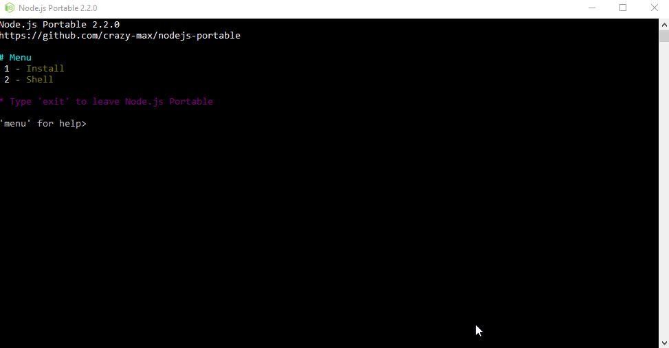
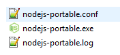

> Node.js Portable 现在被集成进了 [Neard](http://neard.io) ！

<p align="center"><a href="https://github.com/crazy-max/nodejs-portable" target="_blank"></a></p>

<p align="center">
  <a href="https://github.com/crazy-max/nodejs-portable/releases/latest"></a>
  <a href="https://github.com/crazy-max/nodejs-portable/releases/latest"></a>
  <a href="https://ci.appveyor.com/project/crazy-max/nodejs-portable"></a>
  <a href="https://goreportcard.com/report/github.com/crazy-max/nodejs-portable"></a>
  <a href="https://www.codacy.com/app/crazy-max/nodejs-portable"></a>
  <a href="https://www.paypal.com/cgi-bin/webscr?cmd=_s-xclick&hosted_button_id=QEEZEYZ6QTKGU"></a>
</p>

阅读此文档其他语言版本： [English](README.md), [简体中文](README.zh-cn.md).

## 关于

这是一个用 [Go 语言](https://golang.org/) 写的小程序，可以便携化(绿化) Windows 系统上的 [Node.js](http://nodejs.org/) 开发环境<br />
已经在 Windows 7 ， Windows 8.1 和 Windows 10 上测试通过。


> Node.js Portable 的主窗口

配置文件 `nodejs-portable.conf` 会在初次启动时被创造：



## 安装

* 下载 [最新的发布](https://github.com/crazy-max/nodejs-portable/releases/latest) 。

* 将 `nodejs-portable.exe` 放入与 `node.exe` 相同的路径中，或者干脆放进一个空目录来执行自动安装。

  > 非常不推荐将 `nodejs-portable.exe` 放入带中文的路径中，可能会报各种诡异的错误Orz

## 开始使用

运行 `nodejs-portable.exe` ，然后按提示选择：
* **1** 按提示输入版本号和系统架构来自动安装 Node.js。
* **2** 自动配置环境并运行Node.js命令行环境。

> 如果你已经安装完成了 Node.js ，把 `nodejs-portable.exe` 放入含有 `node.exe` 的路径中即可

###  `nodejs-portable.conf` 配置文件

* `workPath` : Shell working dir (can be relative to `nodejs-portable.exe`).
* `customPaths` : Array of custom paths that will be placed in the PATH environment variable (paths can be relative to `nodejs-portable.exe`).
* `immediateMode`: Set this to `true` if you want to use node.js shell immediately.

> If an exception happened, take a look into `nodejs-portable.log` for further information.

## 构建

* 安装 [Go](https://golang.org/dl/) 1.8+
* 将 Go 加入你的 PATH 环境变量 (例如 `C:\Go\bin`)
* 安装 [Java SE Development Kit](http://www.oracle.com/technetwork/java/javase/downloads/jdk8-downloads-2133151.html) 1.8+
* 将 Java 加入你的 PATH 环境变量 (例如 `C:\Program Files (x86)\Java\jdk1.8.0_144\bin`)
* 安装 [Apache Ant](http://ant.apache.org/bindownload.cgi) 1.9+
* 将 Ant 加入你的 PATH 环境变量 (例如 `C:\apache-ant\bin`)

接着，

* Clone 这个项目到 `$GOPATH/src/github.com/crazy-max/nodejs-portable`
* 运行 `ant release` 。生成的可执行文件会位于  `bin\release`

路过你不想用 Java/Ant 来构建此项目，运行：

```
set GOARCH=386
go get -u github.com/Masterminds/glide
glide install -v
go generate -v
go build -v -ldflags "-s -w"
```

> Tips: 由于国内网络环境原因，以下是我总结的天朝用户构造方法

- 设置好 GOPATH 后，进入项目路径下，使用 `go build` 直接编译， 会抛出一堆异常
- 针对丢失的包，`go get 包`
- 然后用 git 对照`glide.lock` 手动 `git reset --hard 版本号`
- 然后再用以下命令编译

```
set GOARCH=386
go generate -v
go build -v -ldflags "-s -w"
```

**一般编译出现问题大多是依赖版本错误** ，嗯，就酱紫。

## 我怎么支持项目？

我们欢迎各种形式的支持 :raised_hands:!<br />
最简单的支持方式就是Star :star2: 这个项目，或者提交 issues :speech_balloon:<br />
任何提供的捐赠将会被用于该项目进一步的开发 :gift_heart:

[](https://www.paypal.com/cgi-bin/webscr?cmd=_s-xclick&hosted_button_id=QEEZEYZ6QTKGU)

## 许可证

MIT。阅读 `LICENSE` 来获得更多细节。<br />
USB 图标感谢 [Dakirby309](http://dakirby309.deviantart.com/) 。<br />
中文翻译 [Retomehere](https://github.com/xiazeyu)。
